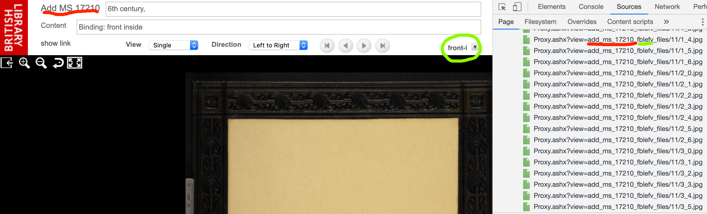

## Image data

### Downloading Deep Zoom  images

The British Library unfortunately does not offer a straightforward way to  download public-domain images of medieval manuscripts directly. Since the end-user browsing interface uses Microsoft's Deep Zoom technology to serve the images, however, it is possible to download all the individual tiles and automatically stitch them together to reconstruct the original with tools like Ryan Baumann's `dzi-dl`.  His [github repository](https://github.com/ryanfb/dzi-dl) offers more documentation, but this page summarizes how to use it for British Library images.


`dzi-dl` reads an XML description of the image from the server.  For the British Museum, the URL of the description will have the form

`https://www.bl.uk/manuscripts/Proxy.ashx?view=$SIGLUM_$PAGE.xml`

where `$SIGLUM` is the BL's identifier for the manuscript, and `$PAGE` the identifier for the page.  When you have determined these values, you can download an image like this:


```
bundle exec ./dzi-dl.rb 'https://www.bl.uk/manuscripts/Proxy.ashx?view=$SIGLUM_$PAGE.xml'
```

Once you have a list of page identifiers for a given manuscript, you can script out a long series of these statements and wait while they download and stitch together all the images for a given manuscript.


### Finding siglum and page identifiers

The identifier for the siglum is based on the siglum traditionally used in the BL's catalog. For manuscript `Add  MS 17210`, for example, the identifier is `add_ms_17210`.

In general, British Library manuscripts seem to follow these conventions for identifying pages:

- regularly numbered folios: 0-padded three-digit number + `r` or `v`
    - rectos:  `fXXXr`
    - versos: `fXXXv`
- spine of codex:  `fbspi`
- front cover: `fblefr`
- inside front cover: `fblefv`
- back cover: `fbrigv`
- inside back cover: `fbrigr`

so the siglum + page identifier for folio 1 recto of this manuscript would be `add_ms_17210_f001r`, and you could download it with this:


```sh
bundle exec ./dzi-dl.rb 'https://www.bl.uk/manuscripts/Proxy.ashx?view=add_ms_17210_f001r.xml'
```

You can verify the identifiers if you use your web browser's developer tools to see what resources are loaded.  This illustration (click for enlarged view) shows the relation of the displayed labels in the user interface to the identifiers used to retrieve images.  The red highlights are the siglum; the green highlights are the page identifiers.  (Ignore the continuation of the identifier string beginning `_files/`.)

[](./imgs/BL-file-names.png)


This shows us that the inside front cover of this manuscript is identifier as page `fblefv` of manuscript `add_ms_17210`.


## CITE cataloging of individual manuscripts


- [urn:cite2:citebl:burney86pages.v1:](./burney86pages/v1/)
- `urn:cite2:citebl:addms17210pages.v1`
- `urn:cite2:citebl:harley5693pages.v1`
