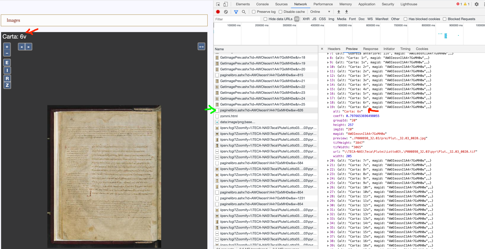

## Image data


### Downloading Deep Zoom  images

The Laurentian Library does not offer a straightforward way to  download public-domain images of medieval manuscripts directly. The end-user browsing interface uses Microsoft's Deep Zoom technology to serve the images, so it is possible to download all the individual tiles and automatically stitch them together to reconstruct the original with tools like [`dezoomify-rs`](https://github.com/lovasoa/dezoomify-rs/releases/tag/v2.0.0).


For sites like the British Library, you can feed dezoomify an XML description of the image directly from the server. (See [details here](https://browsable-mss.netlify.app/data/citebl/).)  For the Laurentian Library, however, the metadata in the XML description often seems to be in error, so you need to go through a little more work to retrieve these images, by formatting a custom YAML description of each image.


You can find and download the metadata you need with your browser's developer tools to inspect the Laurentian's unique interface.  The green arrow shows you the key resource: a link with the form `paginelibro.ash?id=MANUSCRIPT_ID`.  This links to a JSON description of each image.  Here, the red arrows shows an expanded view of the metadata for page `6v` in Laurentian 32.03.


> (Click on image to see larger version.)
[](./imgs/Laur-metadata.png)


You need to extract the following data items from the metadata for each image:

- the manuscript's file path
- the height of the full TIF
- the width of the full TIF
- maximum zoom level (computed from number of 256-step tilings for height and width)


In the example above, the manuscript's file path is `\\\\TECA-NAS\\Teca\\Plutei\\Lotto03\\.\\P000898_32.03\\pyr\\Plut._32.03`, its height is `3847` and width `3065`


For each image, you will create a file named `tiles.yaml` (perhaps most easiliy in a subdirectory for each image) with the following structure:


`url_template: "http://mss.bmlonline.it/fcgi-bin/iipsrv.fcgi?Zoomify=MANUSCRIPT_PATH_`{`{page}}.tif/TileGroup1/{``{zoom_level}}-{``{x/256}}-{``{y/256}}.jpg"`
```
variables:
  - name: x
    from: 0
    to: INSERT tifWidth FROM METADATA
    step: 256

  - name: y
    from: 0
    to: INSERT tifHeight FROM METADATA
    step: 256
  - name: page
    value: INSERT
  - name: zoom_level
    value: INSERT COMPUTED ZOOM LEVEL

headers:
  Referer: http://mss.bmlonline.it/
```

Then run `dezoomify-rs tiles.yaml` to stitch together the original for each image.


## CITE cataloging of individual manuscripts from the Laurentian library

- [urn:cite2:citelaur:laur32pages.v1:](./laur32pages/v1/)
